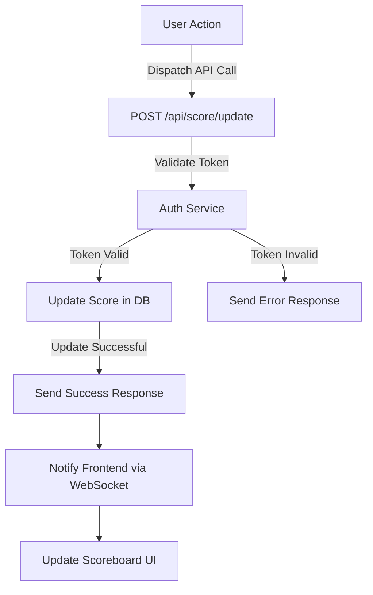

# Problem 5: CRUD Backend Server with ExpressJS and TypeScript

## Configuration

* Install dependencies: `npm install`
* Start server: `npm start`
* Connect to MongoDB: `mongodb://localhost:27017/mydatabase`

## API Endpoints

* `POST /api/resources`: Create a new resource
* `GET /api/resources`: List all resources
* `GET /api/resources/:id`: Get a resource by ID
* `PUT /api/resources/:id`: Update a resource
* `DELETE /api/resources/:id`: Delete a resource

# Problem 6: Architecture

## API Endpoints

* `GET /api/scores/top`: Get top 10 user’s scores.
* `PUT /api/scores/`: Update a score

# Additional Comments

Real-time Updates: For live updates, consider using WebSocket or Server-Sent Events (SSE) to push updates to the frontend whenever the scores are updated.

Caching: Implement caching for the top scores to reduce database load and improve performance.

Monitoring and Logging: Set up monitoring and logging to track API usage and detect any potential issues or abuse.

Action History: Implement a feature to store the history of user actions. This will help verify whether an action should increase the score or not, and prevent users from making fake requests to increase their scores multiple times.

Private Endpoint: Ensure that the score update API endpoint is private and accessible only through internal services or verified clients to enhance security.

Event-Driven Architecture: Implement an event-driven architecture to handle updates more efficiently and ensure a scalable system.

